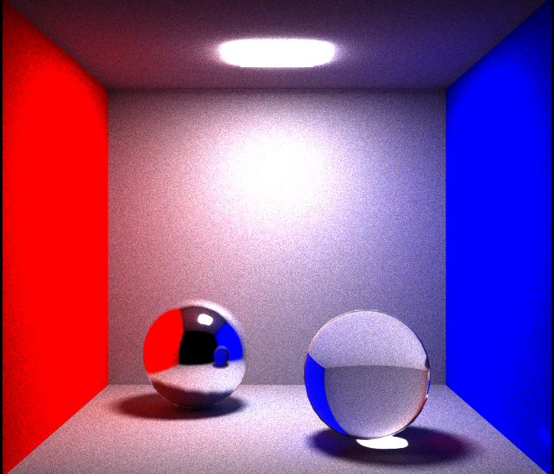
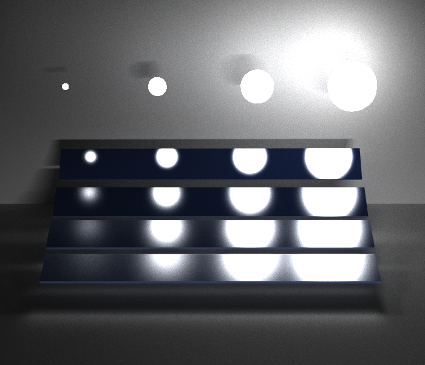
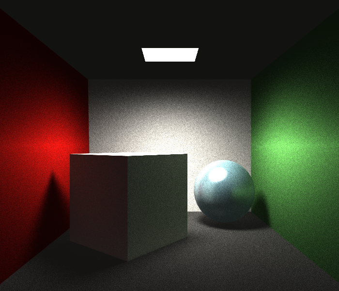

# Monte Carlo Ray Tracing 算法实现

## 实验要求

- 根据给定obj模型文件和mtl材质文件绘制二维图像。
- 使用Monte Carlo Ray Tracing算法。

## 开发环境

- Win10 & Visual Studio 2017。
- CPU i5-4590 & 内存 16.0 GB。
- 注意：VS中若出现fopen函数错误，请在项目属性页中C/C++ ->常规 -> SDL检查置“否”。

## 数据结构

- Vec3f类：三元浮点数组及其运算，可表示三维点，rbg值或矢量等。
- Vec3i类：三元整数组。
- Object类：实体类，可表示一些几何形状。
  - mtl_id：所属材质在Model类中的下标。
  - Model：该实体所属的模型。
- Model类：模型类，用于表示模型信息，继承自Object类。
  - vertexes：模型中的所有顶点。
  - v_normals：模型中的所有的顶点法向量。
  - triangles：模型中的所有三角面片（非三角面片被切分成若干个三角形）。
  - materials：模型中的所有材质。
  - kd_tree：由该模型构成的Kd Tree。
  - box：能容纳该模型且平行于坐标轴的最小包围盒。
- Triangle类：三角形类，用于表示三角面片信息，继承自Object类。
  - v_id：三个顶点在Model类中的下标。
  - vn_id：三个顶点的法向量在Model类中的下标。
  - edge[2]：从顶点0出发的的两条边。
  - normal：三角形的法向量。
  - box：能容纳该三角形且平行于坐标轴的最小包围盒。
- KdTree类：KdTree结构中的一个结点，用于加速，继承自Object类。
  - lower：较小的子树，较大的子树。
  - box：能容纳该结点且平行于坐标轴的最小包围盒
- Material类：材质属性。
  - is_exist：在mtl文件中是否存在。
  - name：材质名称。
  - ka：环境光系数。
  - kd：漫反射系数。
  - ks：镜面反射系数。
  - ke：发光系数。
  - ns：光泽度。
  - ni：折射系数。
- Scene类：场景类，用于绘制图像。
  - lights：全局光照。
  - image：绘制出的图像。
  - width，height：绘制图像的长宽。
  - iteration：用于记录迭代的次数。
  - max_depth：tracing过程中最大深度。
  - model：将要绘制的模型。
  - kd_tree：绘制模型的树形结构。
  - camera：当前场景相机位姿
  - ambirnt：环境光系数
- Ray类：光线类，用于tracing中求交计算。
  - origin：光线发射点。
  - direction：光线方向。
  - source：光线所属类型（直射光，漫反射，全反射，折射光）
  - r_min，r_max：光线参数化后的两个端点。

# 实验参数

- 最大迭代次数：10000
- 最大tracing深度：5
- 图片尺寸：700 * 600
- Field of View：
  - Scene01: 40
  - Scene02: 30
  - Scene03: 60
- 环境光系数：
  - Scene01: (0.0, 0.0, 0.0)
  - Scene02: (0.0, 0.0, 0.0)
  - Scene03: (0.1, 0.1, 0.1)
- 全局光照：
  - Scene01: (0.0, 0.0, 0.0)
  - Scene02: (100.0, 100.0, 100.0)
  - Scene03: (0.0, 0.0, 0.0)

## 实验结果

- scene01.bmp
- scene02.bmp

- scene03.bmp

